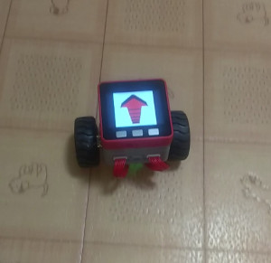

# M5Bala_WiFiControl
M5Bala controlled by WiFi UDP

## Prepare
- [M5BALA](https://www.switch-science.com/catalog/3995/) : Switch Science

## Development Environment
- [Arduino IDE](https://www.arduino.cc/en/main/software)
- [arduino-esp32](https://github.com/espressif/arduino-esp32)

## Dependent library
- [M5Stack](https://github.com/m5stack/M5Stack)
- [MPU6050_tockn](https://github.com/tockn/MPU6050_tockn)

## Controller
You can use SerialPort or [WiFi TCP/UDP Controller](https://play.google.com/store/apps/details?id=udpcontroller.nomal&hl=ja) as the controller. Buttons UP, RIGHT, DOWN, and LEFT are each assigned on characters '8', '6', '2', and '4' in the both case of SerialPort and WiFi UDP. You can set configuration by loading "WiFi_UDP_Controller_config.txt" for WiFi TCP/UDP Controller.
